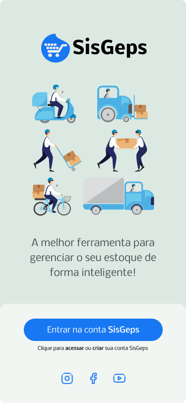
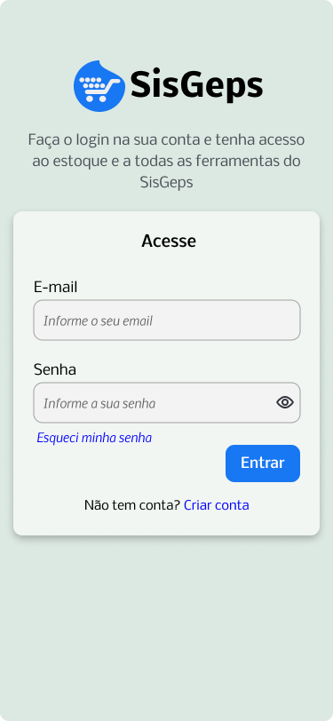
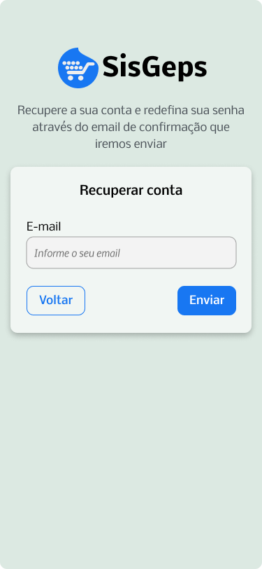
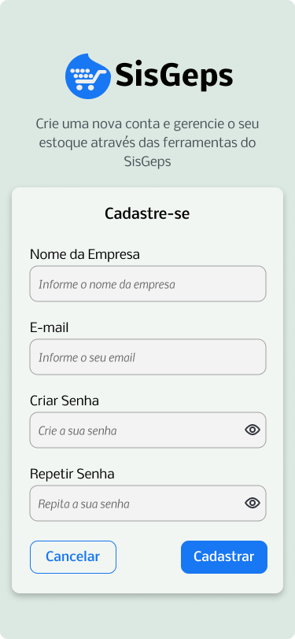

<p align="center">
    
</p>

<h1 align="center"> Sistema de Gerenciamento Estoque para Supermercados</h1>

<h2> <p>&#128187 Equipe de Desenvolvimento</p> </h2>

<table>
    <tr>
        <td>
            <div class="membro">
                                
                <p>DIOGO GABRIEL ROSA SANTOS / 2022011185</p>                
                <a href="https://www.linkedin.com/in/diogogabriel-developer/" target="_blank">LinkedIn</a> -
                <a href="https://github.com/DiogoG-dev" target="_blank">GitHub</a>
            </div>
        </td>
        <td>
            <div class="membro">
                
                <p>JOSÉ KAYO BEZERRA DA SILVA / 2022012638</p>
                <a href="https://www.linkedin.com/in/kayosilva/" target="_blank">LinkedIn</a> -
                <a href="https://github.com/kayopro" target="_blank">GitHub</a>
            </div>
        </td>
        <td>
            <div class="membro">
                
                <p>MATHEUS FAUSE JÁCOME DE LINO / 2022011775</p>
                <a href="https://www.linkedin.com/in/matheus-jacome-lino/" target="_blank">LinkedIn</a> -
                <a href="https://github.com/mfjacome" target="_blank">GitHub</a>
            </div>
        </td>
    </tr>
</table>

<br>
<h2>Descrição</h2>
<p>
Este é um MVP Mobile em sua versão inicial. Ele apresenta funcionalidades essenciais para atender às necessidades básicas dos usuários, com o objetivo de customizar e organizar processos relacionados ao gerenciamento de estoque de supermercados. Para esta primeira versão, nos concentramos em desenvolver o login de acesso ao aplicativo.</p>

<p> Nessa perspectiva, esta documentação será um facilitador para a construção, desenvolvimento e manutenção do sistema. Além disso, esse artefato nos fornece uma comunicação eficaz entre os membros da equipe e demais partes interessadas no projeto. </p> <br>

<h2>Apresentação Audiovisual no Youtube do SisGeps Mobile</h2> 
<p>            
    <a href="https://youtu.be/ewDg7jbxOdo" target="_blank"> Vídeo explicativo MVP Mobile - Versão 1.0 (Disciplina: Projeto Integrado IV) </a> 
</p>

<h2>Apresentação Audiovisual no Youtube do SisGeps WEB</h2> 
<p>            
    <a href="https://youtu.be/VpZJPhAZrUo" target="_blank"> Vídeo explicativo MVP web funcional - Versão 1.0 </a> 
</p> 
<p>            
    <a href="https://youtu.be/oZeYe5YYws8" target="_blank"> Vídeo explicativo MVP web funcional - Versão 2.0 (Disciplina: Desenvolvimento para Web) </a> 
</p>

<br>

<h2>Páginas</h2>
A seguir apresentaremos as telas do SisGeps

<h3>Tela Inicial</h3>
<section>
      <ul>
        <li>A tela inicial foi desenvolvidoa de forma a ser visualmente atraente e despertar o interesse do usuário para que ele explore o aplicativo SisGeps</li>        
      </ul>
    </section>    


<br>
<h3>Tela de Login</h3>
<section>
      <ul>
        <li>Esta tela tem o objetivo de efetuar o cadastro do usuário e possibilitar o acesso ao sistema.</li>        
      </ul>
    </section>    


<br>
<h3>Tela de Recuperação de Conta</h3>
<section>
      <ul>
        <li>A tela de recuperação de conta tem o objetivo de auxiliar o usuário a recuperar o acesso à sua conta em caso de perda de senha, nome de usuário ou outros dados de login. </li>        
      </ul>
    </section>    
<br>

<h3>Tela de Cadastro do Usuário</h3>
<section>
      <ul>
        <li>Esta tela tem a função de Cadastrar um novo usuário em nosso sistema</li>        
      </ul>
    </section>    
<br>

<h2> <p>&#128204 Funcionalidades do projeto</p> </h2>

- `Funcionalidade 1`: Cadastrar usuários;
- `Funcionalidade 2`: Efetuar Login;
- `Funcionalidade 3`: Cadastrar produtos;
- `Funcionalidade 4`: Editar produtos cadastrados;
- `Funcionalidade 5`: Excluir produtos;

<br>

<h2>Tecnologias Utilizadas</h2>

- `Flutter`
- `Dart`

<br>
<h2>Contribuições</h2>
Contribuições são bem-vindas!

<br>

1. Clone o repositório para o seu computador:

```shell
git clone https://github.com/kayopro/MVP-Mobile-SisGeps.git
```

2. Crie uma branch:

```shell
git checkout -b feature/seu_nome
```

3. Commit após implementar sugestões:

```shell
git add nome_arquivo(s)
git status (Verifica quais arquivos estão para ser adicionados);
git commit -m "Descreva de forma objetiva a alteração" (Insere comentário na adição que irá para o repositório remoto);
git push origin nome_branch (feature/seu_nome)
```

Método: Acesse a interface do Github abra um Pull requests da branch que criou para branch main no qual será avaliado antes de ser mergeado.

- `Pull requests`
- `Review`
- `Merge`

<br>
<h2>Considerações Finais</h2>
<p>Por meio do desenvolvimento desse trabalho, conseguimos adquirir valiosas experiências que serão de grande auxílio em projetos futuros. 
O Desenvolvimento deste MVP Mobile não apenas resultou em uma solução robusta e intuitiva para o Sistema de Gerenciamento de Estoque de Supermercados (SisGeps), mas também enriqueceu nosso conhecimento, contribuindo para um aprimoramento contínuo em futuras empreitadas.</p>
